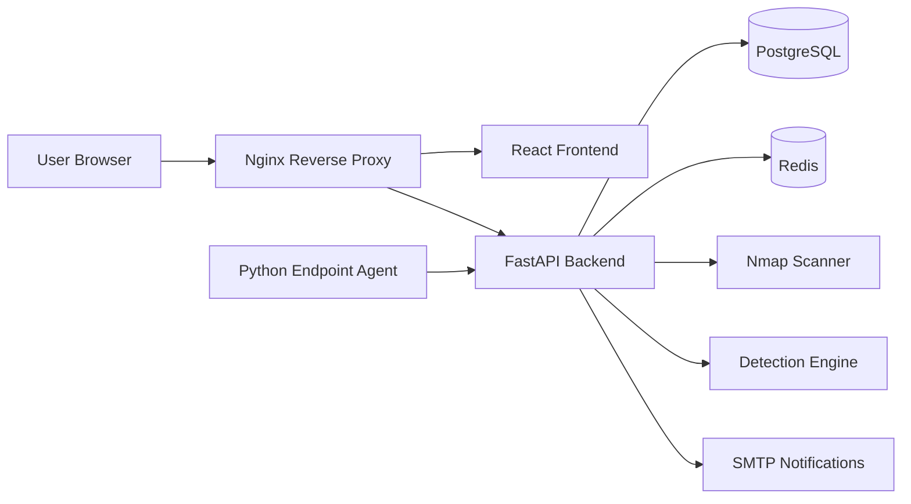

# TechvSOC XDR Platform

TechvSOC XDR Platform is a production-ready security operations and infrastructure visibility platform built for modern teams that need endpoint monitoring, log analysis, rule-based detections, alerting, and operational telemetry in one premium SaaS-style experience.

It combines a FastAPI backend, a React dashboard, a Python endpoint agent, PostgreSQL, Redis, Nginx, and Docker into a cohesive lightweight XDR/SIEM workflow that feels closer to a real product than a demo.

## Why TechvSOC

- Unified command center for logs, alerts, detections, endpoint health, and scans
- Premium frontend experience with glassmorphism, motion, animated charts, theme switching, and responsive navigation
- Role-based JWT authentication for `admin`, `analyst`, and `viewer`
- Python endpoint agent for fleet metrics and log forwarding
- Rule-based detection engine for brute force and suspicious login scenarios
- Nmap-powered port scanning for quick infrastructure exposure checks
- Dockerized deployment path with Nginx reverse proxy, PostgreSQL, and Redis

## Product Preview

### Screenshots

| View | Placeholder |
| --- | --- |
| Dashboard Overview | Add a screenshot of the premium dashboard hero, KPI cards, and fleet charts |
| Detections Workspace | Add a screenshot of the alert feed and rule management panel |
| Monitoring Fleet View | Add a screenshot of endpoint health cards and utilization trends |
| Scanner Module | Add a screenshot of the scan launch form and scan history results |
| Settings and Themes | Add a screenshot showing Dark, Light, and Cyberpunk themes |

## Core Features

### Security Operations

- Centralized log ingestion with upload, parsing, search, and filtering
- Detection engine with built-in and custom rules
- Alert generation with severity-driven workflows
- Suspicious login and brute-force detection logic

### Infrastructure Visibility

- Multi-host endpoint registration
- CPU, memory, disk, uptime, and process monitoring
- Endpoint activity snapshots and fleet posture views
- Nmap-based open-port scanning

### Product Experience

- Premium SaaS UI with animated transitions and glass surfaces
- Theme switching across `Dark`, `Light`, and `Cyberpunk`
- Sidebar animations, hover states, skeleton loaders, and chart motion
- Responsive layout optimized for desktop and tablet workflows

### Performance and Reliability

- Cached API reads for high-traffic dashboard views
- Reduced re-renders via memoized UI primitives and derived data
- Lazy-loaded frontend routes for faster first paint
- Container-ready architecture for local and production deployment

## Architecture



## Stack

| Layer | Technology |
| --- | --- |
| Frontend | React, Vite, Tailwind CSS, Axios, Recharts, Framer Motion |
| Backend | FastAPI, SQLAlchemy, Uvicorn, Pydantic |
| Database | PostgreSQL |
| Cache / Queue | Redis |
| Agent | Python, psutil |
| Reverse Proxy | Nginx |
| Deployment | Docker, Docker Compose |
| Security | JWT authentication, role-based access control |

## Project Structure

```text
techvsoc-xdr/
├── agent/
├── backend/
├── frontend/
├── nginx/
├── docker-compose.yml
└── README.md
```

## Quick Start

### Option 1: Docker Compose

1. Copy the root environment file:

```bash
cp .env.example .env
```

2. Start the platform:

```bash
docker compose up --build
```

3. Open the platform:

- App: `http://localhost`
- API docs: `http://localhost/docs`
- ReDoc: `http://localhost/redoc`

4. To include the endpoint agent profile:

```bash
docker compose --profile agent up --build
```

### Option 2: Local Development

#### 1. Prepare infrastructure

- Start PostgreSQL
- Start Redis
- Make sure the database referenced in `backend/.env` exists
- Install `nmap` for scanner support

#### 2. Start the backend

```bash
cd backend
python3 -m venv .venv
source .venv/bin/activate
pip install -r requirements.txt
cp .env.example .env
python -m app.scripts.init_db
python run.py
```

Backend URLs:

- API root: `http://localhost:8000/`
- Health: `http://localhost:8000/api/v1/health`
- Swagger UI: `http://localhost:8000/docs`

#### 3. Start the frontend

```bash
cd frontend
cp .env.example .env
npm install
npm run dev
```

Frontend URL:

- App: `http://localhost:5173`

#### 4. Start the agent

```bash
cd agent
python3 -m venv .venv
source .venv/bin/activate
pip install -r requirements.txt
cp .env.example .env
python run.py
```

Set `TECHVSOC_AGENT_TOKEN` in `agent/.env` to a valid backend JWT before starting the agent.

## Initial Setup Flow

### 1. Register the first administrator

`POST /api/v1/auth/register`

```json
{
  "full_name": "TechvSOC Admin",
  "email": "admin@techvsoc.local",
  "password": "StrongPass123"
}
```

The first registered account becomes `admin`.

### 2. Log in and capture the JWT

`POST /api/v1/auth/login`

```json
{
  "email": "admin@techvsoc.local",
  "password": "StrongPass123"
}
```

### 3. Verify the session

```bash
curl -X GET http://localhost:8000/api/v1/auth/me \
  -H "Authorization: Bearer TOKEN"
```

## Key Workflows

### Register a monitored endpoint

```bash
curl -X POST http://localhost:8000/api/v1/monitoring/endpoints/register \
  -H "Authorization: Bearer TOKEN" \
  -H "Content-Type: application/json" \
  -d '{
    "hostname": "web-01",
    "ip_address": "10.0.1.15",
    "operating_system": "Ubuntu 24.04",
    "agent_version": "1.0.0",
    "status": "online",
    "last_seen_ip": "10.0.1.15",
    "notes": "Primary frontend server"
  }'
```

### Ingest metrics

```bash
curl -X POST http://localhost:8000/api/v1/monitoring/endpoints/1/metrics \
  -H "Authorization: Bearer TOKEN" \
  -H "Content-Type: application/json" \
  -d '{
    "cpu_usage": 42.7,
    "memory_usage": 68.2,
    "disk_usage": 57.9,
    "uptime_seconds": 93221,
    "process_count": 184,
    "metric_source": "agent",
    "collected_at": "2026-04-23T14:20:00Z"
  }'
```

### Ingest logs

```bash
curl -X POST http://localhost:8000/api/v1/logs/ingest \
  -H "Authorization: Bearer TOKEN" \
  -H "Content-Type: application/json" \
  -d '{
    "logs": [
      {
        "source": "auth-service",
        "event_type": "login_failure",
        "message": "Failed login attempt for admin user",
        "raw_log": "2026-04-23T12:15:00Z ERROR Failed login attempt for admin user",
        "severity": "error",
        "event_timestamp": "2026-04-23T12:15:00Z",
        "metadata_json": {
          "ip_address": "10.0.0.25",
          "username": "admin",
          "country": "IN"
        }
      }
    ]
  }'
```

### Run detections

```bash
curl -X POST "http://localhost:8000/api/v1/detections/run?hours=24" \
  -H "Authorization: Bearer TOKEN"
```

### Launch a port scan

```bash
curl -X POST http://localhost:8000/api/v1/scanner/scan \
  -H "Authorization: Bearer TOKEN" \
  -H "Content-Type: application/json" \
  -d '{
    "target": "127.0.0.1",
    "ports": "22,80,443",
    "arguments": ["-sV"]
  }'
```

## Environment Files

Create the following environment files before running the platform:

```bash
cp .env.example .env
cp backend/.env.example backend/.env
cp frontend/.env.example frontend/.env
cp agent/.env.example agent/.env
```

Important values to review:

- `SECRET_KEY`
- `DATABASE_URL`
- `REDIS_URL`
- `VITE_API_BASE_URL`
- `TECHVSOC_AGENT_TOKEN`
- `POSTGRES_DB`
- `POSTGRES_USER`
- `POSTGRES_PASSWORD`
- `NGINX_PORT`

## Production Notes

- Nginx serves the frontend and proxies backend API traffic
- Redis is available for queueing and caching expansion
- PostgreSQL stores users, logs, alerts, detections, scans, and monitoring data
- The backend container includes `nmap` so the scanner module can run inside Docker
- The frontend uses cached GET requests and lazy-loaded routes to improve perceived performance

## Current UX and Performance Highlights

- Glassmorphism panels, premium shadows, layered gradients, and animated shell surfaces
- Sidebar transitions and route-level motion powered by Framer Motion
- Animated chart areas, pies, and bars for key operational views
- Loading skeletons across dashboard, logs, detections, monitoring, scanner, settings, and route transitions
- Cached API reads and cache invalidation after detection runs, scans, and auth state changes
- Memoized chart data and shared components to reduce unnecessary re-renders

## Future Improvements

- WebSocket-based live event streaming for true real-time alert updates
- Background workers and task queues for scheduled detections and scans
- Alert acknowledgment, assignment, and case management workflows
- Richer correlation engine with MITRE ATT&CK tagging
- SSO and enterprise identity provider integrations
- Multi-tenant workspace support
- PDF or CSV reporting exports
- Frontend code splitting by feature group and deeper bundle optimization
- Automated test coverage for backend APIs, agent flows, and critical frontend routes

## Validation Status

Completed in this workspace:

- Frontend production build
- Python syntax validation for backend and agent
- Docker Compose configuration validation

Still dependent on local runtime environment:

- Full Docker image build and container startup
- Live PostgreSQL, Redis, SMTP, and Nmap runtime verification
- Endpoint agent execution against a running backend
